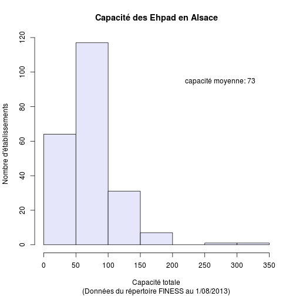

EHPAD
========================================================

- Echec ouverture fichier XML de open data des établissement médico-sociaux: fichier trop volumineux
- extraction des données à partir de la BD Finess *finess.sante.gouv.fr/finess/jsp/actionRechercheSimple.do*
- critères de recherche: 
  - Localisation = ALSACE
  - Domaine: Hébergement personnes âgées [4420]
  - Statut Juridique: Tous
  - Type: Etablissement
  - Etat: Ouvert
  - Catégorie: Toutes
Le fichier est renommé en *ehpad_alsace.csv* et sauvegardé dans *f<-"~/Documents/NRBCE/PBE Alsace/Evac_EHPAD/ehpad_alsace.csv"*
- La terntative de lecture échoue à cause des caractères accentuées des nom de colonnes: *erreur dans make.names(col.names, unique = TRUE) :  chaîne de charactères multioctets incorrecte 5* => suppression via gedit de tous les caractères accentués (é, è, â).
- après correction la lecture fonctionne:

f<-"~/Documents/NRBCE/PBE Alsace/Evac_EHPAD/ehpad_alsace.csv"
d<-read.table(f,header=TRUE,sep=";",as.is=TRUE)

save(d,file="ehpad_alsace.rda")

```r
f <- "~/Documents/NRBCE/PBE Alsace/Evac_EHPAD"
setwd(f)
load("ehpad_alsace.Rda")
names(d)
```

```
##  [1] "Numero.FINESS"           "SIRET"                  
##  [3] "APE"                     "Raison.sociale"         
##  [5] "Complement.distribution" "Adresse"                
##  [7] "Lieudit_BP"              "Code.postal"            
##  [9] "Libelle.routage"         "Tel"                    
## [11] "Fax"                     "Date.ouvert"            
## [13] "Code.categorie"          "Lib.categorie"          
## [15] "Code.statut"             "Lib.statut"             
## [17] "Code.tarif"              "Lib.tarif"              
## [19] "Code.PSPH"               "Lib.PSPH"               
## [21] "FINESS.juridique"        "SOC."                   
## [23] "Discipline1"             "Mode.de.fonctionnement1"
## [25] "Clientele1"              "Capacite.hommes1"       
## [27] "Capacite.femmes1"        "Capacite.totale1"       
## [29] "Discipline2"             "Mode.de.fonctionnement2"
## [31] "Clientele2"              "Capacite.hommes2"       
## [33] "Capacite.femmes2"        "Capacite.totale2"       
## [35] "Discipline3"             "Mode.de.fonctionnement3"
## [37] "Clientele3"              "Capacite.hommes3"       
## [39] "Capacite.femmes3"        "Capacite.totale3"       
## [41] "Discipline4"             "Mode.de.fonctionnement4"
## [43] "Clientele4"              "Capacite.hommes4"       
## [45] "Capacite.femmes4"        "Capacite.totale4"       
## [47] "Discipline5"             "Mode.de.fonctionnement5"
## [49] "Clientele5"              "Capacite.hommes5"       
## [51] "Capacite.femmes5"        "Capacite.totale5"       
## [53] "Discipline6"             "Mode.de.fonctionnement6"
## [55] "Clientele6"              "Capacite.hommes6"       
## [57] "Capacite.femmes6"        "Capacite.totale6"       
## [59] "X"
```

codes:
- 200 maison de retraite
- 207 accueil de jour
- 202 logement foyer

clientèle:
- 700 Personnes Agées (Sans Autre Indication)
- 701 Personnes Agées Autonomes
- 711 Personnes Agées dépendantes

Disciplines:
- Soins médico sociaux aux personnes âgées
  - 177 Section Cure Médicale (dont)
  - 354 Restaurant pour Personnes Âgées
  - 355 Activité des Centres de Jour pour Personnes Âgées
- Hébergement personnes âgées
  - 657 Accueil temporaire pour Personnes Âgées
  - 659 Hébergement en résidence pour personnes âgées
  - 924 Accueil en Maison de Retraite
  - 925 Hébergement Logement-Foyer Personnes Âgées Seules F1
  - 926 Hébergement Logement-Foyer Personnes Âgées Couple F2
  - 927 Hébergement Logement-Foyer Personnes Âgées F1 Bis
  - 938 Hébergement en Hospice
  - 961 Pôles d'activité et de soins adaptés
  - 962 Unités d'hébergement renforcées
  - 963 Plateforme d'accompagnement et de répit des aidants (PFR)


```r
summary(as.factor(d$Code.categorie))
```

```
## 200 202 207 
## 221  55  16
```

On isole les rubriques pertinentes, correspondant au code 200, maison de retraite:

```r
epad <- d[d$Code.categorie == 200, c(1, 4, 8, 9, 13, 25, 28, 31, 34, 37, 40, 
    43, 46, 49, 52, 55, 58)]
nrow(epad)
```

```
## [1] 221
```

Pour chaque ligne on forme la somme des capacités, et on ajoute la colonne à *epad*

```r
ct <- epad[, seq(7, 17, 2)]
sct <- rowSums(ct, na.rm = T)
summary(sct)
```

```
##    Min. 1st Qu.  Median    Mean 3rd Qu.    Max. 
##     4.0    46.0    69.0    73.1    90.0   350.0
```

```r
epad <- cbind(epad, sct)
hist(sct, xlab = "Capacité totale", main = "Capacité des Ehpad en Alsace", 
    ylab = "Nombre d'établissements", sub = "(Données du répertoire FINESS au 1/08/2013)", 
    col = "lavender")
legend(200, 100, legend = "capacité moyenne: 73", bty = "n", cex = 1)
```

 

```r
print("EHPAD ayant plus de 150 places d'hébergement")
```

```
## [1] "EHPAD ayant plus de 150 places d'hébergement"
```

```r
epad[epad$sct > 140, c(1, 2, 4, 18)]
```

```
##     Numero.FINESS                       Raison.sociale     Libelle.routage
## 73      670787894     MR EMMA\xdcS KOENIGSHOFFEN-EHPAD  STRASBOURG CEDEX 2
## 108     670793736 MR HOPITAL LOCAL DE MOLSHEIM - EHPAD            MOLSHEIM
## 115     670794395                 MR NEUENBERG - EHPAD           INGWILLER
## 116     670794478             CHDB BISCHWILLER - EHPAD   BISCHWILLER CEDEX
## 118     670794635           M.R. AMRESO-BETHEL - EHPAD      OBERHAUSBERGEN
## 180     680003019              MR DU CDRS COLMAR EHPAD        COLMAR CEDEX
## 205     680004793    CENTRE POUR PERSONNES AGEES EHPAD        COLMAR CEDEX
## 253     680011384                  MR DE RIXHEIM EHPAD       RIXHEIM CEDEX
## 255     680011400            MR 'LES MAGNOLIAS'  EHPAD            SIERENTZ
## 257     680011426    MR HIVA STE MARIE AUX MINES EHPAD STE MARIE AUX MINES
## 262     680012481                  M R DE L'ARC  EHPAD            MULHOUSE
##     sct
## 73  151
## 108 164
## 115 144
## 116 200
## 118 190
## 180 350
## 205 252
## 253 168
## 255 167
## 257 141
## 262 165
```

Différences entre le 67 (br) et le 68 (hr):

```r
pop.67.2010.municipale <- 1095905
pop.68.2010.municipale <- 749782

br <- epad[substr(epad$Numero.FINESS, 1, 2) == "67", ]
hr <- epad[substr(epad$Numero.FINESS, 1, 2) == "68", ]
nrow(br)
```

```
## [1] 134
```

```r
sum(br$sct)
```

```
## [1] 9366
```

```r
summary(br$sct)
```

```
##    Min. 1st Qu.  Median    Mean 3rd Qu.    Max. 
##     4.0    42.2    64.0    69.9    90.0   200.0
```

```r
sum(br$sct) * 1e+05/pop.67.2010.municipale
```

```
## [1] 854.6
```

```r

nrow(hr)
```

```
## [1] 87
```

```r
sum(hr$sct)
```

```
## [1] 6795
```

```r
summary(hr$sct)
```

```
##    Min. 1st Qu.  Median    Mean 3rd Qu.    Max. 
##     5.0    52.5    73.0    78.1    90.0   350.0
```

```r
sum(hr$sct) * 1e+05/pop.68.2010.municipale
```

```
## [1] 906.3
```


